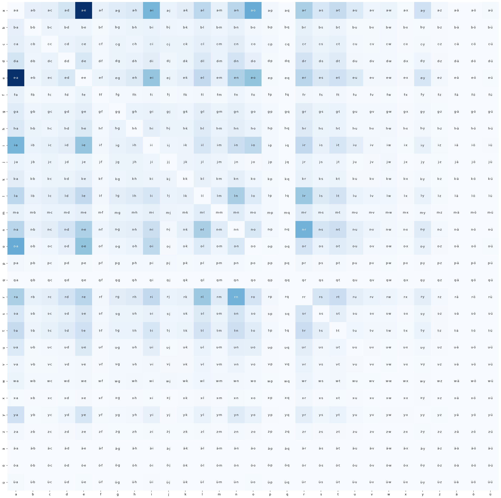

# LetterVariations

Simple python program to extract the most likely letter variations out of a list of first names, e.g. (d-t), (a-e).
For the first names "Anna" and "Anne" the only letter variation is (a-e)/(e-a).
Character variations of unrelated names will be weighted less.

# Requirements 
Uses NumPy, matplotlib and seaborn.
The list of names should be in a file called ```names.dat```.  
Each name should be on it's own line

# Example Output
